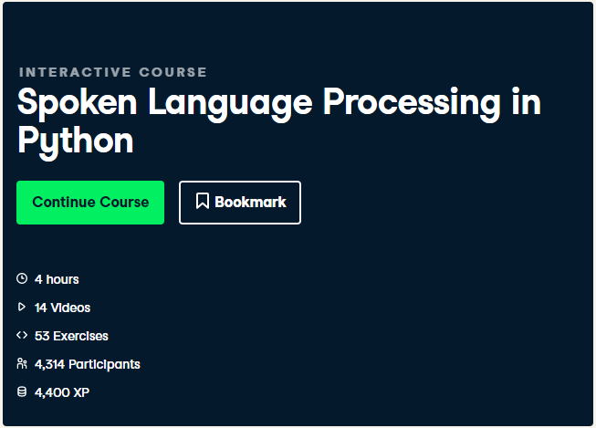

<h1> Audio Processing With Python </h1>

 In this repository I put all the codes that I made while learning how to process audio with python.  
Firstly from the <a href="https://app.datacamp.com/learn/courses/spoken-language-processing-in-python">course</a> obtained from DataCamp  

and many more to come.

